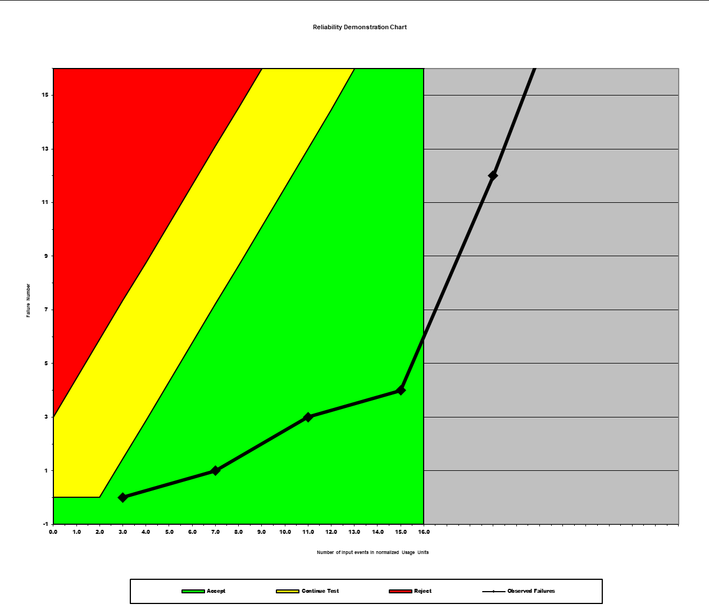

**SENG 637- Dependability and Reliability of Software Systems***

**Lab. Report \#5 – Software Reliability Assessment**

| Group \#:       |   |
|-----------------|---|
| Student Names:  |   |
|       Ameen          |   |
|            Kunj     |   |
|                Md Rakin |   |
|               Saif |   |
|                Mohammad |   |

# Introduction
In this lab we explored reliability assessment tools like C-SFRAT, which helped us understand failure rates, mean time between failures (MTTF), and overall system reliability.
# 

# Assessment Using Reliability Growth Testing 

We used the Covariate Software Failure and Reliability Assessment Tool (C-SFRAT) for our reliability growth testing. It's user-friendly and offers the ability to simultaneously evaluate multiple models.

Figure 1: Cumulative Failure Plot

### Result of model comparison (selecting top two models)

We ran an estimation using all selected hazard functions and covariates along with the complete failure data, shown in Figure 2. We evaluated the models using Log-Likelihood to determine their fit with the data. The best-performing models were the IFR Generalized Salvia & Bollinger (IFRGSB) with covariates E, F, and the Discrete Weibull Type III (DW3) with covariate F, shown in Figure 3.

Figure 2: Cumulative Failure Plot w/ all fitted models superimposed 

Figure 3: Comparison of all models sorted by log-likelihood

### Result of range analysis (an explanation of which part of data is good for proceeding with analysis)

By analyzing the complete dataset, we observe the overall reliability trends of the system, aiming for a failure target of one failure per 10 time intervals, aiming for zero defects in our projections, shown in Figure 4.

Figure 4: Range Analysis, given Target Failure Rate 

### Plots for failure rate and reliability of the SUT for the test data provided

We manually calculated the average time between failures, as the C-SFRAT software lacked this feature and SRTAT couldn't import our data. Our analysis covered the entire dataset to understand the reliability growth across the system.

Figure 5: Time between failure 

Figure 6: Failure Intensity

### A discussion on decision making given a target failure rate

Given a target failure rate, decision-making involves selecting a model that accurately predicts when and how often failures occur. This is crucial for planning maintenance and upgrades, ensuring system availability, and minimizing downtime. In this assessment, setting a stringent failure target of one failure per 10 time intervals encouraged us to opt for models that demonstrated the best predictive accuracy and reliability over time. This approach aids in understanding the system's behavior under real-world operating conditions, which in turn supports more informed, data-driven decision-making regarding the system's deployment and maintenance.

# Assessment Using Reliability Demonstration Chart 

For the RDC tool, we used the last 16 entries from our failure data due to its limitation of handling only 16 data points. Figures 7 through 9 display the acceptable MTTF values.

Figure 7: MTTF - 1 unit

Figure 8: MTTF - 2 units

Figure 9: MTTF - 4 units 

### A discussion on the advantages and disadvantages of RDC 

The Reliability Demonstration Chart (RDC) offers the advantage of visual simplicity and ease of understanding, making it an accessible tool for demonstrating system reliability at a glance. However, its disadvantages include a limited data capacity (only 16 data points), which may not provide a comprehensive view of the system's performance over time. This limitation can skew the perceived reliability if the selected data subset is not representative of overall system behavior. 
# 

# Comparison of Results

The outcomes from C-SFRAT and RDC were significantly different, primarily due to each program's capabilities. C-SFRAT's extensive features allowed us to examine more data, suggesting an ideal scenario of zero defects, while RDC indicated a range of acceptable defects.

# Discussion on Similarity and Differences of the Two Techniques

C-SFRAT provided a continuous view of system failures over time, while RDC-11 presented a threshold of acceptable failures for system release. Both methods offer objective assessments under different conditions.

# How the team work/effort was divided and managed

All team members explored the tools independently before deciding on the best-performing one. We ensured accuracy and consensus by cross-verifying our findings and collaborated using shared communication platforms.

# 

# Difficulties encountered, challenges overcome, and lessons learned

The provided software tools were challenging to use and limited in their capabilities, requiring manual calculations for certain graphs. The application of statistical methods was enlightening, highlighting the need for more intuitive software that meets the demands of such assignments.

# Comments/feedback on the lab itself

It was great to get experience using software that is used in the industry.